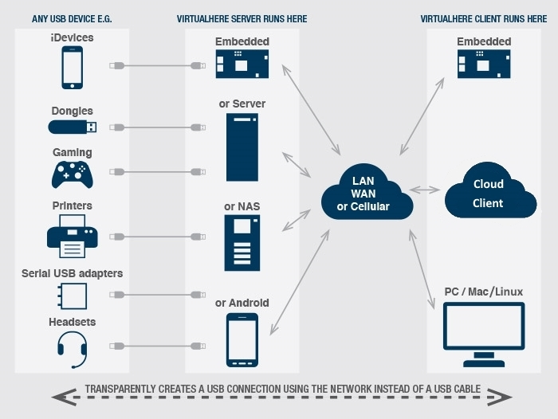

# docker-virtualhere-client

This repo provides an example showing how to access remote USB devices from within a Docker container using [VirtualHere](https://www.virtualhere.com/).

Here is a high-level overview of the process to get this working:

1. Install the VirtualHere USB Server software on the "server" device. This is the device that will have a physical USB device plugged into its USB ports.
2. Install Docker on the "client" device. This is the device that will host the Docker containers that need to interact with the USB device(s) physically attached to the server.
3. Build and run a Docker container which bundles the VirtualHere USB Client software, allowing the container to access the remote USB device(s).



## VirtualHere USB Server Setup

Install the VirtualHere USB Server from <https://www.virtualhere.com>

Navigate to the "USB Servers" tab on the top navigation and follow the directions to install the server software that matches the type of machine that will host the physical USB devices. For example, to install the server software on a Mac Mini, follow the directions on the [MacOS USB Server](https://www.virtualhere.com/osx_server_software) page.

It's possible to install the server software on an embedded Linux device like a Raspberry Pi or a BeagleBone Black board. VirtualHere provides a handy script to install the server software on a Linux host: <https://github.com/virtualhere/script>

For a detailed tutorial on how to set up VirtualHere USB Server on a BeagleBone Black, see https://blog.golioth.io/usb-docker-windows-macos/

> [!NOTE]
> Since the VirtualHere client is going to be running in console only mode within a Linux container, the VirtualHere server requires a paid license to be installed on the server hardware (see <https://www.virtualhere.com/purchase> for pricing details).

## Docker Setup

Install Docker Desktop on the machine that will host the containers. Mac, Windows, and Linux links are provided at <https://docs.docker.com/desktop/>

After installing, start Docker Desktop on the client machine.

> [!TIP]
> Mac users should check out <https://orbstack.dev> for a lightning fast alternative to Docker Desktop for Mac. OrbStack is a drop-in replacement for Docker Desktop and offers additional features (like running Linux virtual machines).

## Docker Container Setup

This repository contains an example `Dockerfile` that shows how to build a Docker image with the VirtualHere Client pre-installed. You can adapt this example for any Docker container that needs to remotely access USB devices attached to a VirtualHere server.

### Build the Docker Image

Specify the VirtualHere client binary to use by passing in the `VHCLIENT` build argument:

- amd64: `vhclientx86_64`
- i386: `vhclienti386`
- armhf: `vhclientarmhf`
- aarch64: `vhclientarm64`
- mipsel: `vhclientmipsel`

```sh
docker build --build-arg VHCLIENT=vhclientarm64 -t "cgnd/vhclientarm64" .
```

The commands below use the `vhclientarm64` client which was tested on macOS running on Apple Silicon.

### Run the Docker Container

The following command will run the container and start an interactive session at the container's prompt:

```sh
docker run -it --rm --privileged --net=host --name vhclient cgnd/vhclientarm64
```

> [!IMPORTANT]
> In the following steps, make sure to use the VirtualHere client that matches the `VHCLIENT` argument specified when building the Docker image.

In the container, run the VirtualHere Client as a daemon:

```sh
vhclientarm64 -n
```

The following command will display a list of devices that were automatically found by the client:

```sh
vhclientarm64 -t "LIST"
```

Unless the VirtualHere server is part of the same network as the docker container, the USB devices will most likely not show up by default. In this case, the server needs to be added manually (make sure to use the IP address of the host):

```sh
vhclientarm64 -t "MANUAL HUB ADD,192.168.1.142:7575"
```

Now, the USB devices attached to the server should show up in the list:

```
vhclientarm64 -t "LIST"
```

For example:

```plaintext
root@orbstack:/# vhclientarm64 -t "LIST"
VirtualHere Client IPC, below are the available devices:
(Value in brackets = address, * = Auto-Use)

BeagleBone Black (BeagleBone:7575)
   --> TTL232R-3V3 (BeagleBone.11)

Auto-Find currently on
Auto-Use All currently off
Reverse Lookup currently off
Reverse SSL Lookup currently off
VirtualHere Client is running as a service
```

The `"USE,<address>[,password]"` command will instruct the VirtualHere client to make one of the USB devices available within the container. For example, to use the `TTL232R-3V3` USB-to-Serial converter:

```sh
vhclientarm64 -t "USE,BeagleBone.11"
```

Running `vhclientarm64 -t "LIST"` shows that the USB device is "In-use":

```
root@orbstack:/# vhclientarm64 -t "LIST"
VirtualHere Client IPC, below are the available devices:
(Value in brackets = address, * = Auto-Use)

BeagleBone Black (BeagleBone:7575)
   --> TTL232R-3V3 (BeagleBone.11) (In-use by you)

Auto-Find currently on
Auto-Use All currently off
Reverse Lookup currently off
Reverse SSL Lookup currently off
VirtualHere Client is running as a service
```

Finally, `lsusb` shows the device is connected to the USB bus:

```
root@orbstack:/# lsusb
Bus 002 Device 001: ID 1d6b:0003 Linux 6.11.9-orbstack-00279-g4cf512143f2e vhci_hcd USB/IP Virtual Host Controller
Bus 001 Device 002: ID 0403:6001 FTDI TTL232R-3V3
Bus 001 Device 001: ID 1d6b:0002 Linux 6.11.9-orbstack-00279-g4cf512143f2e vhci_hcd USB/IP Virtual Host Controller
```

> [!IMPORTANT]
> Although the USB device is showing up in the container, the corresponding `/dev/ttyUSB0` device is not available in the container. This appears to be an issue with Docker Desktop (see <https://github.com/docker/for-win/issues/4548>).
>
> However, the `/dev/ttyUSB0` device does show up in *new* containers. It appears that the workaround is to use a dedicated container for managing the VirtualHere client, and separate containers to actually access the connected USB devices.
>
> In the example above, running a second container allows access to the `/dev/ttyUSB0` device:
>
> ```sh
> ❯ docker run -it --rm --privileged --name vhclient2 cgnd/vhclientarm64
> root@d766c34f1d6e:/# lsusb         
> Bus 002 Device 001: ID 1d6b:0003 Linux 6.10.14-linuxkit vhci_hcd USB/IP Virtual Host Controller
> Bus 001 Device 004: ID 0403:6001 FTDI TTL232R-3V3
> Bus 001 Device 001: ID 1d6b:0002 Linux 6.10.14-linuxkit vhci_hcd USB/IP Virtual Host Controller
> root@d766c34f1d6e:/# ls /dev/ttyUSB0
> /dev/ttyUSB0
> ```
>
> If anybody knows how to get the device to show up in the original container, please feel free to file an issue in this repo!

## Alternatives to VirtualHere

VirtualHere is a mature commercial USB-over-IP solution and is actively supported. However, it is not open-source and requires a paid license for each server device.

As of version [4.35.0](https://docs.docker.com/desktop/release-notes/#4350), Docker Desktop [supports USB/IP](https://docs.docker.com/desktop/features/usbip/) and can be used with open-source USB/IP server implementations like [jiegec/usbip]( https://github.com/jiegec/usbip). The main downside of this solution is that there is not currently a good USB/IP server implementation for macOS. Check out this tutorial from the folks at [Golioth](https://golioth.io/) for more details: https://blog.golioth.io/usb-docker-windows-macos/
